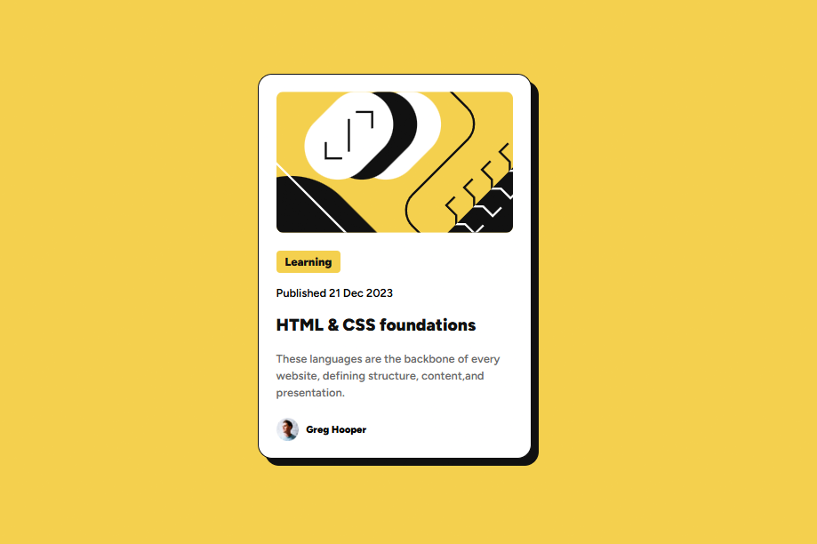

# Frontend Mentor - Blog preview card solution

This is a solution to the [Blog preview card challenge on Frontend Mentor](https://www.frontendmentor.io/challenges/blog-preview-card-ckPaj01IcS). Frontend Mentor challenges help you improve your coding skills by building realistic projects. 

## Table of contents
- [The challenge](#the-challenge)
- [Screenshot](#screenshot)
- [Links](#links)

### The challenge

Users should be able to:

- See hover and focus states for all interactive elements on the page

### Screenshot

### Links
- Live Site URL(https://adil-solkar.github.io/blog-preview-card-main-frontendmentor-challenge/)

## Author
- Frontend Mentor - [@yourusername](https://www.frontendmentor.io/profile/Adil-Solkar)
